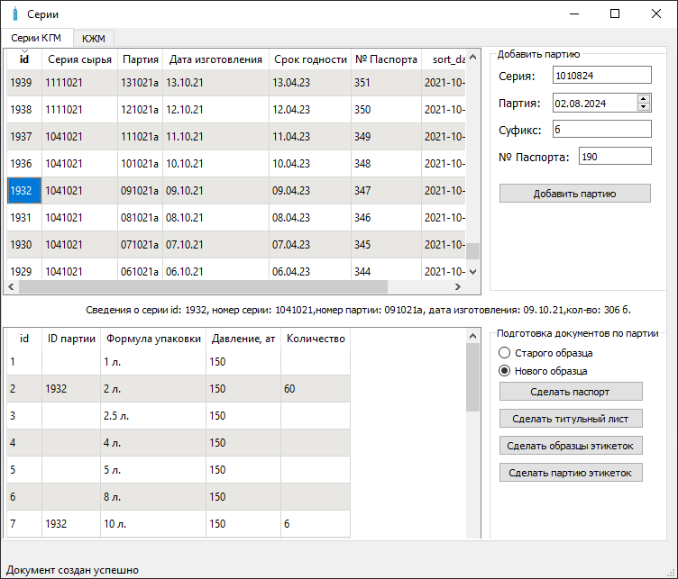

## Приложение автоматизирующее работу с документами на баллоны

В верхней части окна задаются серии, в нижней состав серии


## How to fix deps
```shell
uv pip compile pyproject.toml > lock.txt
```

## How to load sql-dump
```shell
DUMP_SQLITE_PATH=dumps/2024-12-14.db DB_IP=localhost DB_USER=postgres DB_PASSWORD=postgres python -m cylinders.export_data.export_sqlite_in_pg
```

## How to update volumes from csv
```shell
DB_IP=localhost DB_USER=postgres DB_PASSWORD=postgres LOAD_VOLUMES=migrations/volumes-2024-12.csv python -m cylinders
```


## How to run
```shell
DB_IP=localhost DB_USER=postgres DB_PASSWORD=postgres DB_TYPE=postgres python -m cylinders
```
